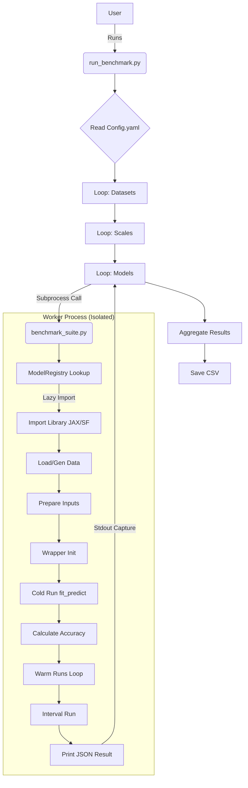

# Code Architecture & Execution Flow

## 1. Project Overview

**Purpose**:  
The codebase is a **Benchmarking Suite** designed to rigorously compare the performance (speed/scalability) and accuracy of two time-series forecasting libraries:
1.  **Chronax**: A JAX-based forecasting library (focusing on GPU acceleration and JIT compilation).
2.  **StatsForecast**: A high-performance forecasting library based on Numba.

**Key Goals**:
*   Isolate library runtimes to avoid dependency conflicts (using subprocesses).
*   Measure "Cold Start" (compilation+training) vs. "Warm" (inference) times.
*   Measure overhead for generating prediction intervals.
*   Evaluate accuracy using standard metrics (MAPE, MAE, etc.).

**Core Technologies**:
*   **Python**: Primary language.
*   **JAX**: For Chronax models (supports XLA compilation, GPU execution).
*   **StatsForecast**: For baseline models.
*   **Pandas/Numpy**: Data manipulation.
*   **YAML**: Configuration management.

---

## 2. Execution Flow (Step-by-Step)

The workflow consists of an **Orchestrator** (`run_benchmark.py`) that spawns isolated **Worker Processes** (`benchmark_suite.py`) for each experiment configurations.

### A. Orchestrator Initialization (`run_benchmark.py`)

1.  **Entry Point**: `if __name__ == "__main__":`
    *   **Input**: CLI arguments (`--config`, `--model`, `--dataset`, `--forecast`).
    *   **Action**: parses arguments and calls `run_benchmark()`.

2.  **`run_benchmark(config_path, ...)`**:
    *   **Step 1: Load Config**: Reads `config.yaml` to get experiment settings (scales, horizon, etc.), environments (python paths), datasets, and model lists.
    *   **Step 2: Initialize Directories**: Creates `benchmark_results/` (and `forecast_results/` if needed).
    *   **Step 3: Main Execution Loops**:
        *   **Outer Loop**: Iterate through valid **Datasets**.
        *   **Middle Loop**: Iterate through **Scales** (series lengths).
            *   *Note*: External CSV datasets ignore scales and run on the full file length.
        *   **Inner Loop**: Iterate through **Models**.

3.  **Subprocess Spawning**:
    *   For each `{Dataset, Scale, Model}` combination:
    *   **Action**: Constructs a command line execution string.
    *   **Logic**: Selects the appropriate Python interpreter (`chronax_python` vs `sf_python`) defined in config.
    *   **Call**: `subprocess.run([python_exe, "eval_dev/benchmark_suite.py", ...])`
    *   **Wait**: Blocks until the subprocess completes.
    *   **Capture**: Reads `stdout` looking for the delimiter `RESULT_JSON:::`.

### B. Worker Execution (`benchmark_suite.py`)

This script runs as a completely independent process for *one single model run*.

1.  **Initialization**:
    *   **Imports**: Standard libraries only (sys, os, json). **Heavy libraries (JAX, StatsForecast) are NOT imported yet** to minimize startup overhead and prevent interference.
    *   **CLI Parsing**: Reads arguments passed by orchestrator (`--model`, `--library`, `--dataset`).

2.  **`run_single_model(...)`**:
    *   **Registry Lookup**: Calls `ModelRegistry.get_model_entry(model_name)`.
        *   Retrieves the class constructor and default parameters.
        *   **Lazy Import**: The registry imports the specific model file (e.g., `import auto_ets`) only at this exact moment.

    *   **Data Loading**:
        *   **If External**: Reads CSV via `pd.read_csv`, handles target columns, splits into Train/Test (`y_train`, `y_test`) based on `horizon`.
        *   **If Synthetic**: Calls `generate_series()` to create numpy arrays (Trend, Seasonality, etc.) of the requested `length`.

    *   **Input Preparation** (`prepare_inputs`):
        *   Converts data to `jnp.array` (for Chronax) or `pd.DataFrame` (for StatsForecast).
        *   **JAX Import**: JAX is imported here for the first time if needed.

    *   **Wrapper Instantiation**:
        *   Creates `ChronaxWrapper` or `SFWrapper`.
        *   **Action**: Initializes the model object with parameters.

3.  **Benchmarking Phases**:

    *   **Phase 1: Cold Start** (`Time_Cold_Sec`)
        *   **Action**: Calls `fit_predict()`.
        *   **Chronax Detail**: Triggers JAX JIT compilation (XLA). This is usually slow.
        *   **StatsForecast Detail**: Triggers Numba compilation.

    *   **Phase 2: Accuracy Check**
        *   Compares predictions vs `y_test`.
        *   Calculates `MAPE`, `MAE`, `RMSE`, `MASE`.

    *   **Phase 3: Warm Runs** (`Time_Warm_Sec`)
        *   **Loop**: Runs `n_iterations` times (default 5).
        *   **Action**: Calls `fit_predict(..., intervals=False)`.
        *   **Purpose**: Measures pure inference speed (post-compilation).

    *   **Phase 4: Interval Overhead** (`Interval_Overhead_Pct`)
        *   **Action**: Calls `fit_predict(..., intervals=True)`.
        *   **Calculation**: `(Time_Interval - Time_Warm) / Time_Warm`.

4.  **Completion**:
    *   **Output**: Packages results into a Dictionary.
    *   **Serialization**: Uses `SafeEncoder` to handle JAX/Numpy types.
    *   **Print**: Prints `RESULT_JSON:::{json_string}` to stdout.

### C. Aggregation (Back in `run_benchmark.py`)

1.  **Parse Result**: Orchestrator extracts JSON from the subprocess output.
2.  **Logging**: Prints progress (Time, Accuracy) to valid console.
3.  **Storage**: Appends record to `results_records` list.
4.  **Finalization**:
    *   Converts list to DataFrame.
    *   Saves `benchmark_results/benchmark_{timestamp}.csv`.
    *   (Plotting is currently disabled).

---

## 3. Hardware Utilization

| Component | Hardware | Utilization Details |
| :--- | :--- | :--- |
| **Orchestrator** | **CPU** | Minimal. Parses config and manages subprocesses. |
| **Chronax Models** | **GPU / TPU** | **Heavy**. Uses JAX. automatically targets GPU if `jax[cuda]` is installed. Leverages XLA (Accelerated Linear Algebra) for matrix ops. |
| | **RAM** | Moderate to High. JAX pre-allocates memory. Large datasets (50k+) increase VRAM usage. |
| **StatsForecast** | **CPU** | **High**. Uses Numba to compile Python to optimized machine code. Runs on multiple cores if configured (though `n_jobs=1` is set in wrapper to ensure fair comparison per-core or to avoid contention). |
| **Data Geneation** | **CPU** | Numpy operations for synthetic data. Single-threaded. |

*   **Parallelization**: The current script runs models **sequentially** (loop). Use of parallel subprocesses is not currently implemented in `run_benchmark.py`, focusing on stability and accurate timing measurement without resource contention.

---

## 4. Data Flow

1.  **Input**:
    *   **Config**: `config.yaml` (Parameters).
    *   **Data Source**:
        *   *Synthetic*: Generated in-memory (Numpy arrays).
        *   *External*: Read from Disk (`.csv`).

2.  **Transformation**:
    *   Raw Data $\to$ `Numpy Array` (Split Train/Test).
    *   `Numpy Array` $\to$ `Jax Array` (for Chronax) OR `Pandas DataFrame` in long format (for StatsForecast).

3.  **Model I/O**:
    *   Input: History Array (`y_train`).
    *   Output: Forecast Array (`float32`), optional Prediction Intervals.

4.  **Output**:
    *   **Console**: Real-time logs.
    *   **File**: `benchmark_results.csv` containing flat records of metrics.
    *   **File** (Forecast Mode): Raw forecast data `.csv` and plots (currently disabled).

---

## 5. Visualization (Execution Graph)

## 6. Summary

The Chronax Benchmark Suite allows for fair, isolated comparisons between JAX-based and Numba-based forecasting models. By using a **multi-process architecture**, it ensures that:
1.  JAX memory pre-allocation does not affect StatsForecast runs.
2.  Library-specific import overheads are measured correctly (or excluded via lazy loading).
3.  Failures in one model do not crash the entire benchmark.

The system is designed to run locally, utilizing the CPU for orchestration and StatsForecast, and handing off heavy computation to the GPU (via JAX) for Chronax models where available.
